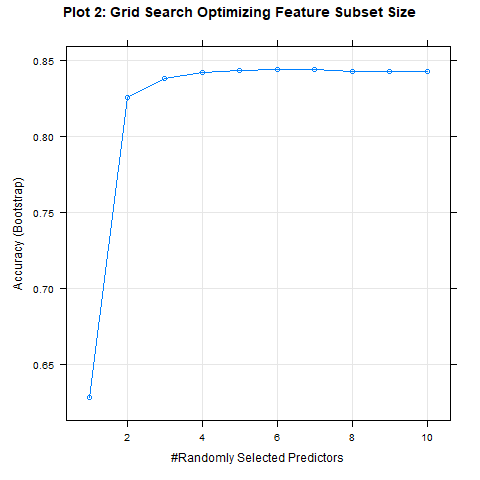
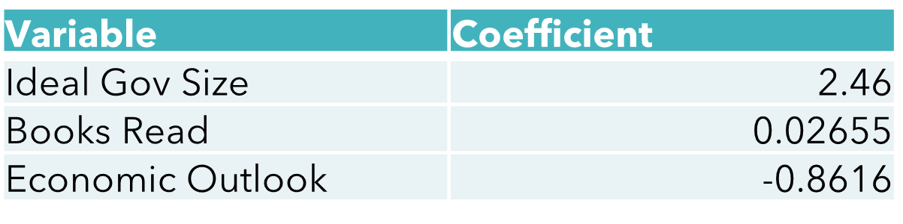

\abstract{This paper compares logistic regression models with random forest models. The dataset examined using these models is the 2021 National Public Opinion Reference Survey (NPORS), and the models predict the respondent's political party vote. The datasets and the two models' backgrounds and summaries are presented. The implementation of these models is done in R. The final accuracy for the random forest model is slightly higher, by a nonsignificant amount. Model interpretation and training time is shown to be better for the logistic regression model. The variable importance plots reveal key features of the dataset such as the respondent's ideal government size. Newer model selection algorithms for logistic regresssion and more comprehensive parameter optimization for random forests are identified as potential improvements.}

\fontsize{12}{12}
\selectfont


# 1. Introduction

## 1.1 Data Background

This research uses Logistic regression and random forests, two statistical techniques for binary classification, to predict binary voting outcomes for respondents of the 2021 National Public Opinion Reference Survey (NPORS). This survey conducted by the Pew Research Center collected data about voting, political affiliation, demographics, religion, internet use, and more from 3937 U.S. adults. In total, the respondents to the survey answered 41 questions, of which the majority consisted of questions with categorical responses. Approximately sixty percent of the respondents took the paper survey, while the rest took it online. The sample "draw was a national, stratified random sample, with differential probabilities of selection across the mutually exclusive strata" designed to represent the U.S. population. Thus, an analysis conducted on this survey sample provides a reasonable conclusion for the broader U.S. voting population.

This research uses a dataset with 62 explanatory variables: one for each of the 41 survey questions and additional ones that are categorical variables converted into multiple binary variables. The survey question for whom the respondents voted has three response options in addition to the representatives of the two primary parties. To exclude observations who voted for any of these three additional response options from the dataset is appropriate, as they account for a small percentage of total votes and the U.S. follows a two-party system, namely the Republican and Democratic parties. Next, we provide background on the two statistical techniques.

## 1.2 Methodology Background

The logistic function was invented in the 19th century to model population growth and was first used as an alternative to the probit model for bioassay in 1943 [@cramer2002origins]. A logistic regression model allows for predicting a categorical response variable, whereas the linear regression model predicts a continuous response variable based on the explanatory variables. The three types of logistic regression based on the response variables are - binary, multinomial, and ordinal. This research focuses on binary logistic regression, used when the response variable has two outcomes. Given a linear relationship between the transformed response and predictors,  a logistic regression model provides an easy-to-interpret and implement model without the need for parameter tuning. The use cases of logistic regression are endless, ranging from applications in the medical field for disease prediction to industrial engineering for equipment failure prediction.

Random Forests was developed more recently in 2001 by L. Breiman, who combined his approach for bagging decision trees and T. K. Ho's method to randomly select features. Random forests were developed to improve traditional decision tree models, particularly to reduce overfitting. Unlike logistic regression, random forests can predict both categorical and continuous response variables. Random forests create a "forest" of decision trees, where the trees draw data from the training data set with replacement. After applying other statistical techniques discussed later, the final prediction is the average of the outputs of the decision trees. Like logistic regression, random forests have a wide range of applications in several fields like tech, finance, and medicine.


# 2. Methods And Materials


## 2.1 NPORS Dataset Preprocessing

Before using the survey dataset to train our models, we must transform it into a usable condition. The first step of data preprocessing involves dealing with missing data and incorrect categorical responses. The dataset is primarily categorical, and imputing missing data with the most frequent value could potentially introduce bias into the data [@palczewska2014interpreting]. Thus, we decide to drop rows with incorrect or missing data. The next step of data cleaning is to check and remove features that display multicollinearity. One measure of multicollinearity is VIF (Variation Inflation Factor) which we use for assessing our data. Features that have VIF values over 10, a popular cutoff threshold for VIF, are removed from our dataset. Some other steps included in data preprocessing are removing features that cause perfect separation in our data or have high ratios of missing data. The previous data preprocessing steps are requirements for fitting logistical regression models, and while random forests can inherently handle missing data and multicollinearity, doing so before training often produces more reliable results [@genuer2010variable]. Finally, the data undergoes a 70:30 split for creating the training and testing sets which will allows direct compare any models we fit in the results section. 

## 2.2 Binary Logistic Regression

Binary Logistic regression is a regression model that predicts the probability of a binary response variable given one or several explanatory variables. Equation 1 shows the logistic regression function. The left-hand side of this equation is known as the log-odds or the logit function. The log-odds function maps the "probability ranging between [0,1] to log odds ranging from (-inf,inf)" [@pampel2020logistic]. The log of the probability odds is taken instead of odds because the odds (P(X)/1-P(X)) restrict the range of values to [0,inf). By not restricting the range of values as such, the correlation between our response and predictors does not decrease. Similar to linear regression, the relationship between the logit function and the data X is assumed to be linear. For demonstration, the two classes our response variable can be are "1" or "0".

\begin{equation}
  \label{eq:1}
\log(\frac{p(X)}{1-p(X)})=\beta_0+\beta X
\end{equation}

The inverse of the logit function, shown in equation 2, is known as the sigmoid function. The output of this function is the probability that lies between [0, 1] for our response variable being '1'.

\begin{equation}
  \label{eq:2}
p(X)=\frac{e^{\beta_0+\beta X}}{1+e^{\beta_0+\beta X}}
\end{equation}

For logistic regression parameter estimation, instead of using Ordinary Least Squares (OLS) such as in linear regression models, Maximum Likelihood Estimation (MLE) is the most accepted parameter estimation function. Both OLS and MLE yield similar results, as noted in this study, where the MLE regression provides better accuracy on average and produces predictions bounded by the [0, 1] range of the sigmoid function. OLS predictions may lie outside this range or produce negative least squares values, which is why MLE is more popular than OLS estimation for binary logistic regression [@pohlmann2003comparison]. MLE maximizes the likelihood function, given in equation 3, and can be re-written after substituting the formula for p(x) and transformed as a summation in equation 4. One approach to minimize this likelihood function is to differentiate the log-likelihood function with respect to one of its components (for example: ${\beta_k}$), set the equation to zero, and solve as shown in equation 5.   

\begin{equation}
  \label{eq:3}
L(\beta_0,\beta)=\Pi_{i=1}^np(x_i)^y_i(1-p(x_i)^{1-y_i})
\end{equation}

\begin{equation}
  \label{eq:4}
L(\beta_0,\beta)=\sum_{i=1}^n -\log1+e^{\beta_0+\beta X}+\sum_{i=1}^n y_i(\beta_0+x\beta)
\end{equation}

\begin{equation}
  \label{eq:5}
\frac{\partial l}{\partial \beta_k}=\sum_{i=1}^n(y_i-p(x_i|\beta_0, \beta))x_{ij}
\end{equation}

After fitting a logistic regression model and producing some probability p of the response variable belonging to one of two possible classes, for demonstration we call it class "1". Then, we calculate a prediction by checking if p > threshold, then class "1", otherwise class "0". The default threshold value is 0.5, but depending on case-specific requirements, this can be optimized by finding the optimum point on the ROC (Receiver Operating Characteristic) curve, which minimizes the false-positive rate while maximizing the true-positive rate [@hoo2017roc]. Unlike linear regression, there are no stringent normality assumptions of residuals for logistic regression. The main assumptions of logistic regression are: a linear relationship must exist between log odds and independent variables, a large sample size with independent observations and minimal strong outliers, and no multicollinearity between independent variables [@pampel2020logistic]. Given these assumptions are met, logistic regression provides a simple to implement and interpret model for binary classification.

For our logistic regression model for predicting voting outcomes, we start by assessing the assumptions stated earlier. The training sample size is large, and we removed features with high multicollinearity during data preprocessing. Before we check for the linear relationship between transformed response (log-odds) and predictors, we first reduce our full model into a smaller model with fewer predictors. We use backward stepwise regression, which removes predictors at each step until the AIC no longer reduces. Doing so makes checking the linearity assumption easier and prevents model overfitting to our sample, which is a common issue for logistic regression. Other popular model selection algorithms we considered were LASSO and Forward Stepwise Selection. While these algorithms may provide a model that produces more accurate predictions on our testing dataset, often that comes as a cost of overfitting our model to the dataset. Finally we decide our threshold value for predicting based of the ROC curve, which we discuss in the results section. 

## 2.3 Random Forests for Binary Classification

Random forest is a supervised machine learning technique that averages multiple decision trees, trained on random sub-samples of the training dataset with replacement. Since random forests averages decision trees, decision trees are explained first before random forests. Like random forests, the decision tree is also a supervised machine-learning technique, which can predict both continuous and categorical variables. A decision tree has a tree structure, where the starting node, known as the root node, divides the data into two or more mutually exclusive subsets, which are called decision nodes. These decision nodes further split the data on a feature selected by calculating node purity by the "Gini Index" shown by equation 6. [@song2015decision]

\begin{equation}
  \label{eq:6}
Gini\ Index = 1 - \sum_{i=1}^n(P_i)^2
\end{equation}

${P_i}$ in the equation above is the probability of data belonging to the subset where the feature of the node belongs to class "i". The decision tree algorithm selects features with a low Gini score (and therefore low impurity) at each node. The Gini Index is the most popular method to compute decision tree features due to its computational efficiency. The decision tree computes nodes until the data cannot be split further (or some stop mechanism is met), where the final nodes are known as the leaf nodes. These leaf nodes are split from decision trees using the response variable as the final prediction feature [@song2015decision].

The random forest algorithm employs random sub-sampling of the training dataset on which decision trees are created,  a  technique known as Bootstrap Aggregation developed by L. Breiman. The issue with only employing bootstrap aggregation is that the decision trees have a lot of structural similarity due to the Gini Index selecting similar features for each tree, resulting in highly correlated predictions. To avoid this, a random forest only trains the decision trees on the subset of features, where the size of the subset is a parameter that must be specified to train the model. By default, the parameter is the square root of the total number of explanatory variables by default. The random forest algorithm selects the subset of features by prioritizing the most relevant features ranked by the Gini Index. This process of random feature selection reduces the correlation between the decision trees and also prevents overfitting. The final output of the random forest is selected by a process known as Majority Voting in the classification case, where the response most decision trees voted for is selected. This process of averaging decision trees classifies random forest as an Ensemble Method [@palczewska2014interpreting]. 

There are no distribution assumptions needed to be made for random forests, nor does random forest require training data to have complete data. However, compared to logistic regression models, random forest requires tuning three parameters for optimal results. The first, and most important parameter, is the max number of features allowed for a decision tree. Generally, a larger number of max features (decreases increasingly) results in more tree diversity, while a smaller amount increases training speed. The second parameter is the number of trees, which presents a tradeoff between computation speed and prediction precision. The third parameter is the minimum number of sample leaves for the decision tree, where a smaller number of leaves are more susceptible to data noise. The most straightforward way to tune these parameters is by brute forcing multiple parameter combinations and selecting the combination providing the best accuracy. There are several other parameters, like max decision tree depth, subsample size, minimum samples per split, and others that can be tweaked depending on case-specific conditions.

In our implementation for the random forest, we focus on optimizing our parameters to strike a balance between reasonable training times and high prediction accuracy. Search algorithms are commonly used for optimizing parameters by finding arguments that maximize or minimize model accuracy for a given parameter. Note that it is possible to optimize other aspects of the model instead of accuracy, like true or false positive rates. Examples of search algorithms listed from slowest to fastest are Grid Search, Random Search, Bayesian Optimization, and Gradient Optimization to name a few. In our case, we optimize our parameters to provide the best model accuracy using Grid Search. This approach allows us to specify a range of values to test for each parameter, and while this takes a longer training time, it also allows for greater control and a more comprehensive search [@mohapatra2020optimization]

# Results

```{r setup, include=FALSE}
knitr::opts_chunk$set(warning = FALSE, message = FALSE) 
```

```{r echo=F, results='hide', fig.show='hide'}
library(dplyr)
library(ggplot2)
library(haven)
library(car)
library(detectseparation)
library(caret)
library(ROCR)
library(pROC)
library(tornado)
library(MASS)

df <- as.data.frame(read_sav("C:/Users/darsh/School/year4_temp/STAT 4893W/Independent Research Project/NPORS 2021.sav"))

dim(df)

# Drop columns: PARTY_AP21, PARTYLN_AP21, WEIGHT, BASEWEIGHT, INTERVIEW_START_AP21, INTERVIEW_END_AP21, DATERECEIVED_AP2
# Reasons - columns are either redundant (we are predicting a variation of PARTY_AP) or are not valuable (too many NA, or no correlation with predicted val)
# Drop single level factors - DEVICE1a_AP21, VOTED2020_AP21 
dropped_columns <- c('PARTY_AP21', 'PARTYLN_AP21', 'WEIGHT', 'BASEWEIGHT', 'INTERVIEW_START_AP21', 'INTERVIEW_END_AP21', 'DATERECEIVED_AP21', 'DEVICE1a_AP21', 'VOTED2020_AP21', 'RESPID_AP21')
#df <- df %>% select(-dropped_columns)
df <- df[ , !names(df) %in% dropped_columns]

# replace values of "99" with NA for all categorical columns, and drop NA
df[-c(50, 31)] <- lapply(df[-c(50, 31)], gsub, pattern = "99", replacement = NA, fixed = TRUE)
df <- df %>% na.omit()
dim(df)

# Convert all columns to factors
index <- 1:ncol(df)
df[,index]<-lapply(df[,index], as.factor)

# Convert some columns to numeric
df$AGE_AP21 <- as.numeric(df$AGE_AP21) # Age - Q33. (COLUMN 50 in df)
df$BOOKS1_AP21  <- as.numeric(df$BOOKS1_AP21) # number of books read - Q16. (COLUMN 31 in df)
df$ADULTSINHH_AP21 <- as.numeric(df$ADULTSINHH_AP21)

## Relabel categories for plotting purposes
df$VOTEGEN_POST_AP21 <- droplevels(df$VOTEGEN_POST_AP21)
levels(df$VOTEGEN_POST_AP21) <- c("Republican", "Democrat", "Libertarian", "Green", "other")

df$GENDER_AP21 <- droplevels(df$GENDER_AP21)
levels(df$GENDER_AP21) <- c('Male', 'Female', 'Other')


levels(df$RACECMB_AP21) <- c('White', 'Black or African American', 'Asian or Asian American', 'American Indian or Alaska Native', 'Native Hawaiian or Pacific Islander', 'Other')


vif(glm(VOTEGEN_POST_AP21 ~.,family=binomial(link='logit'), data=df))

# Chech for multicollinearity using VIF (Variance Inflation Factor) & Drop columns accordingly (threshold = 10)
dropped_columns <- c('RACEMOD_1_AP21', 'RACEMOD_2_AP21', 'RACEMOD_3_AP21', 'RACEMOD_4_AP21', 'RACEMOD_5_AP21', 'RACEMOD_6_AP21')
df <- df[ , !names(df) %in% dropped_columns]

# add 
#(inf_check <- check_infinite_estimates(glm_model))
#glm_model <- glm(VOTEGEN_POST_AP21 ~.,family=binomial(link='logit'), method='detect_separation', data=df)


```


```{r echo=F, results='hide', fig.show='hide'}
# Produce frequency tables 
ft_party <- df %>% group_by(VOTEGEN_POST_AP21) %>% summarise(freq=n())
ft_gender <- df %>% group_by(GENDER_AP21) %>% summarise(freq=n())
ft_race <- df %>% group_by(RACECMB_AP21) %>% summarise(freq=n())
ft_party

ggplot(df, aes(VOTEGEN_POST_AP21, fill = GENDER_AP21)) +
         geom_bar(position = "dodge") +  ggtitle("Political Party Vote Counts by Gender") + xlab("Political Party")+ylab("Count") + scale_fill_discrete(name = "Gender")

ggplot(df, aes(VOTEGEN_POST_AP21, fill = RACECMB_AP21)) +
         geom_bar(position = "dodge")+  ggtitle("Political Party Vote Counts by Race") + xlab("Political Party")+ylab("Count") + scale_fill_discrete(name = "Race")

df <- df %>% filter(VOTEGEN_POST_AP21=="Republican" |VOTEGEN_POST_AP21=="Democrat")
df$VOTEGEN_POST_AP21 <- droplevels(df$VOTEGEN_POST_AP21)

ggplot(df, aes(VOTEGEN_POST_AP21, fill = GENDER_AP21)) +
         geom_bar(position = "dodge") +  ggtitle("Political Party Vote Counts by Gender") + xlab("Political Party")+ylab("Count") + scale_fill_discrete(name = "Gender")

ggplot(df, aes(VOTEGEN_POST_AP21, fill = ECON1BMOD_AP21)) +
         geom_bar(position = "dodge") +  ggtitle("Political Party Vote Counts by Economic Level") + xlab("Political Party")+ylab("Count") + scale_fill_discrete(name = "Economic Level")

ggplot(df, aes(VOTEGEN_POST_AP21, fill = INCOME_AP21)) +
         geom_bar(position = "dodge") +  ggtitle("Political Party Vote Counts by Income") + xlab("Political Party")+ylab("Count") + scale_fill_discrete(name = "Income Level")

ggplot(df, aes(VOTEGEN_POST_AP21, fill = RACECMB_AP21)) +
         geom_bar(position = "dodge")+  ggtitle("Vote Counts by Race") + xlab("Political Party")+ylab("Count") + scale_fill_discrete(name = "Race")


df$GOVSIZE1_AP21 <- droplevels(df$GOVSIZE1_AP21)
levels(df$GOVSIZE1_AP21) <- c('Small, Less Services', 'Large, More Services')


ggplot(df, aes(VOTEGEN_POST_AP21, fill = df$GOVSIZE1_AP21)) +
         geom_bar(position = "dodge")+  ggtitle("Vote Counts by Ideal Government Size") + xlab("Political Party")+ylab("Count") + scale_fill_discrete(name = "Race")
```


```{r echo=F, results='hide', fig.show='hide'}

#set.seed(324923498792748273)

#for (i in range 1:10)
df$id <- 1:nrow(df)


train <- df %>% dplyr::sample_frac(.75)
test  <- dplyr::anti_join(df, train, by = 'id')
train <- train[ , !names(train) %in% c("id")]
test <- test[ , !names(test) %in% c('id')]
```

We fitted a logistical regression model using backward stepwise regression and ended up with a model with 23 predictor variables. The model has an 85.00% accuracy with a 95% confidence interval of [0.824, 0.876]. The ROC curve plot shows the tradeoff between sensitivity and specificity (true-positive rate and false-positive rates) for our model. We identify no issues from this plot since the curve belongs to the top right quadrant, which strikes a good balance between the true and false-positive rates. We test multiple threshold values and re-plot the ROC, and finally choose 0.5 (the optimal threshold was approximately 0.543). The ROC plot is displayed below (plot 1).


```{r echo=F, results='hide', fig.keep='all', out.width='85%'}

glm.model <- glm(VOTEGEN_POST_AP21 ~.,family=binomial(link='logit'), data=train)

# Final Model via backwards stepwise regression

#glm.model <- stepAIC(glm.model, direction=c("backward"))

probs <- predict(glm.model, newdata = test, type = "response")
roc_curve <- roc(test$VOTEGEN_POST_AP21~probs, plot=T, xlab="False Positive Rate", ylab="True Positive Rate",main="Plot 1: ROC Curve" )


fitted.results <- predict(glm.model,test,type='response')
fitted.results <- ifelse(fitted.results <= 0.5,"Republican", "Democrat")
fitted.results <- as.factor(fitted.results)
levels(fitted.results) <- ordered(c( "Democrat", "Republican"))

misClasificError <- mean(fitted.results != test$VOTEGEN_POST_AP21)
print(paste('Accuracy',1-misClasificError))
confusionMatrix(data=fitted.results, reference=test$VOTEGEN_POST_AP21)


fitted.results.numeric <- ifelse(fitted.results == "Republican", 1, 2)


# Threshold tuning
# ROCRpred <- prediction(fitted.results.numeric, as.numeric(test$VOTEGEN_POST_AP21))
# ROCRperf <- performance(ROCRpred, measure = "tpr", x.measure = "fpr")
# # Find the threshold value that maximizes the F1 score
# optimal <- which.max(as.double(performance(ROCRpred, "f")@y.values))
# threshold <- perf@alpha.values[[1]][optimal]
# # Print the optimal threshold value
# print(threshold)


```


Our random forest model optimized using grid search produces an 87.07% accuracy, with a 95% confidence interval of [0.845, 0.897]. All decision tree parameters were set to default values, as we focus on optimizing parameters unique to random forests: max number of trees (trees=600) and feature subset size for decision trees (features=6). Increasing the value for these two parameters results in diminishing accuracy increases at the cost of longer training times. The grid search plot for tuning feature subset size is displayed below (plot 2).

{width=400px}

```{r echo=F, results='hide', fig.show='hide'}
library(randomForest)
library(mlbench)
library(caret)
library(e1071)
# 
# # We choose other popular ntree values in range
# # ntree_test <- c(200, 300, 400, 500, 600, 700, 1000) and test them one by one and use ntree = 600 as it provides good accuracy and fast train time
# rf.model <- randomForest(VOTEGEN_POST_AP21 ~., data=train, ntree=600)
# 
# 
# control <- trainControl(method='repeatedcv',
#                         number=10,
#                         repeats=3,
#                         search='grid')
# #create tunegrid with 15 values from 1:15 for mtry to tunning model. Our train function will change number of entry variable at each split according to tunegrid.
# 
# tunegrid <- expand.grid(.mtry = (1:10))
# 
# rf_gridsearch <- train(VOTEGEN_POST_AP21 ~ .,
#                        data = df,
#                        method = 'rf',
#                        metric = 'Accuracy',
#                        tuneGrid = tunegrid)
# 
# best_mtry <- rf_gridsearch$bestTune[1]
# print(rf_gridsearch)
# plot(rf_gridsearch, main="Plot Grid Search Optimizing Feature Subset Size")
# #mtry=5 selected
# 
# 
# png(filename = "optim2.png")
# plot(rf_gridsearch, main="Plot 2: Grid Search Optimizing Feature Subset Size")
# dev.off()

```

Next, we compare the results of the two models. We cannot use ANOVA or F-Test to compare model accuracy because the models use different predictors. However, the accuracies for the two models fall within each other's 95% confidence interval, indicating that the difference in accuracy may not be statistically significant. When we look at the confusion matrix tables for each model, we see that the logistic regression model more accurately predicted Republican respondents (LM: 83.7%, RF: 80.4%), while the random forest model was more accurate at predicting Democratic respondents (LM: 85.8%, RF: 91.7%).

Finally, we compare the variable importance plots for the two models (Plot 3 and 4). The top three most important variables are the same for both models, but we notice a difference for the fourth-ranked variable. In the random forest model, the response to the question of whether the survey respondent's race is black or African American is not included in the top ten most important variables. Furthermore, the ordering of these variables is different for both models. This difference can be attributed to how variable importance is measured for the models. Random forest models rank variables by mean decrease accuracy and Gini index, while logistic regression relies on calculations using the varImp function from the caret package, which uses the absolute value of the t-statistic for ranking variables by importance [@caret]. As a result, a direct comparison of the two variable importance plots may be misleading.


```{r echo=F, results='hide', fig.keep='all', out.width='100%'}


```


```{r echo=F, results='hide', fig.keep='all', out.width='95%'}

par(mfrow=c(1,2))
glm.model <- glm(VOTEGEN_POST_AP21 ~.,family=binomial(link='logit'), data=train)
glm_imp <- varImp(glm.model, type=2, plot=T)
glm_imp[2] <- rownames(glm_imp)

glm_imp <- glm_imp[order(glm_imp$Overall, decreasing=T), ]
glm_imp_head <- head(glm_imp, n=10)
glm_imp_head <- glm_imp_head[order(glm_imp_head$Overall, decreasing=F), ]

 l1 <- c('Ideal Gov. Size', 'Economic Outlook', 'Opinion on Corp.', 'Black or African American', 'Religion', 'Books Read', 'Income', 'Age', 'US Workforce', 'Education Lvl')
l1 <- rev(l1)
glm_imp_head['names'] <- l1


dotchart(glm_imp_head$Overall,labels=glm_imp_head$names,
   main="Plot 3: Logistic Regression Var. Imp.",
   xlab="VarImp Score", cex.main=0.70, cex.lab=.6, cex.main=0.8)

library(randomForest)
#print(rf.model)
rf.model <- randomForest(VOTEGEN_POST_AP21 ~., data=train, ntree=600, mtry=6, importance=T)
#out.importance <- round(importance(rf.model), 2)

#impToPlot <- importance(rf.model, scale=FALSE)
impToPlot <- rf.model$importance[,4]
dotplot_labels=c('Ideal Gov. Size', 'Economic Outlook', 'Religion', 'Opinion on Corp.', 'Income', 'US Workforce', 'Age', 'Race',  'Education Lvl', 'Books Read', 'Marital Status')

#dotchart(sort(impToPlot[,1])[35:45], xlab="Mean Decrease Gini Score", labels = rev(dotplot_labels), main='Variable Importance')
#dotchart(sort(impToPlot[,1])[35:45], xlab="%IncMSE")

dotchart(sort(impToPlot)[35:45], labels=rev(dotplot_labels), xlab="Mean Decrease Accuracy", main="Plot 4: Random Forest Var. Imp.", cex.main=0.70, cex.lab=.6, , cex.main=0.8)

fitted.results.rf <- predict(rf.model,test,type='response')


misClasificError.rf <- mean(fitted.results.rf != test$VOTEGEN_POST_AP21)
print(paste('Accuracy',1-misClasificError.rf))
confusionMatrix(data=fitted.results.rf, reference=test$VOTEGEN_POST_AP21)

```


# Conclusion

In conclusion, while random forests slightly outperform our logistic regression voting prediction accuracy, it is deemed statistically insignificant due to confidence interval overlap. The accuracies for logistic regression and random forest are 85% and 87%. The training and optimization of random forests took significantly longer than the training and model selection for logistic regression. Other than the predictions, it is hard to measure the impact of individual variables for the random forest model due to its black-box-like nature. On the other hand, the logistic regression model provides interpretable coefficients for each predictor. For example, figure 1 below shows that a respondent with a negative economic outlook will have smaller prediction log odds, increasing the probability of being classified as a Republican by our model. An advantage of random forest models is that they do not have any statistical assumptions and that they can capture nonlinear relationships within the data, unlike logistic regression.



The variable importance plots helped identify two variables of interest: "Ideal Government Size" and "Is respondent Black or African American". After plotting these two variables by respondent political affiliation we notice clear trends. In plot 6, we see that respondents who prefer a smaller government are more likely to vote for Republicans, and vice-versa. Plot 5 shows that Black/African American voters are more likely to vote Democrat.


{width=600px}

```{r echo=F, results='hide', fig.show='hide'}


ggplot(df, aes(VOTEGEN_POST_AP21, fill = RACECMB_AP21)) +
         geom_bar(position = "dodge")+  ggtitle("Plot 5: Vote Counts by Race") + xlab("Political Party")+ylab("Count") + scale_fill_discrete(name = "Race")

```

```{r echo=F, results='hide', fig.show='hide'}
df$GOVSIZE1_AP21 <- droplevels(df$GOVSIZE1_AP21)
levels(df$GOVSIZE1_AP21) <- c('Small, Less Services', 'Large, More Services')


ggplot(df, aes(VOTEGEN_POST_AP21, fill = df$GOVSIZE1_AP21)) +
         geom_bar(position = "dodge")+  ggtitle("Plot 6: Vote Counts by Ideal Government Size") + xlab("Political Party")+ylab("Count") + scale_fill_discrete(name = "Response")

```

This study can be improved by testing newer methods for model selection for logistic regression, such as "LASSO" or other gradient-boosting algorithms. Our random forest models can be improved by doing a more comprehensive grid search by increasing the range over which we fit models and also by optimizing decision tree parameters which we forego in this paper. Furthermore, testing the most frequent value imputation should on features with minimal missing value may prove fruitful as it would reduce the number of data points that need to be dropped and therefore increase our training dataset size. Overall, both methods provided highly accurate predictions (85%+ accuracy) for our particular dataset, the 2021 NPORS Survey Data.


\pagebreak

# References

::: {#refs}
:::

\pagebreak

# Appendix

Note: Parameter tuning functions are commented out due to long training time (>2hrs) 

```{r}
library(dplyr)
library(ggplot2)
library(haven)
library(car)
library(detectseparation)
library(caret)
library(ROCR)
library(pROC)
library(tornado)
library(MASS)

df <- as.data.frame(read_sav("C:/Users/darsh/School/year4_temp/STAT 4893W/Independent Research Project/NPORS 2021.sav"))

dim(df)

# Drop columns: PARTY_AP21, PARTYLN_AP21, WEIGHT, BASEWEIGHT, INTERVIEW_START_AP21, INTERVIEW_END_AP21, DATERECEIVED_AP2
# Reasons - columns are either redundant (we are predicting a variation of PARTY_AP) or are not valuable (too many NA, or no correlation with predicted val)
# Drop single level factors - DEVICE1a_AP21, VOTED2020_AP21 
dropped_columns <- c('PARTY_AP21', 'PARTYLN_AP21', 'WEIGHT', 'BASEWEIGHT', 'INTERVIEW_START_AP21', 'INTERVIEW_END_AP21', 'DATERECEIVED_AP21', 'DEVICE1a_AP21', 'VOTED2020_AP21', 'RESPID_AP21')
#df <- df %>% select(-dropped_columns)
df <- df[ , !names(df) %in% dropped_columns]

# replace values of "99" with NA for all categorical columns, and drop NA
df[-c(50, 31)] <- lapply(df[-c(50, 31)], gsub, pattern = "99", replacement = NA, fixed = TRUE)
df <- df %>% na.omit()
dim(df)

# Convert all columns to factors
index <- 1:ncol(df)
df[,index]<-lapply(df[,index], as.factor)

# Convert some columns to numeric
df$AGE_AP21 <- as.numeric(df$AGE_AP21) # Age - Q33. (COLUMN 50 in df)
df$BOOKS1_AP21  <- as.numeric(df$BOOKS1_AP21) # number of books read - Q16. (COLUMN 31 in df)
df$ADULTSINHH_AP21 <- as.numeric(df$ADULTSINHH_AP21)

## Relabel categories for plotting purposes
df$VOTEGEN_POST_AP21 <- droplevels(df$VOTEGEN_POST_AP21)
levels(df$VOTEGEN_POST_AP21) <- c("Republican", "Democrat", "Libertarian", "Green", "other")

df$GENDER_AP21 <- droplevels(df$GENDER_AP21)
levels(df$GENDER_AP21) <- c('Male', 'Female', 'Other')


levels(df$RACECMB_AP21) <- c('White', 'Black or African American', 'Asian or Asian American', 'American Indian or Alaska Native', 'Native Hawaiian or Pacific Islander', 'Other')


vif(glm(VOTEGEN_POST_AP21 ~.,family=binomial(link='logit'), data=df))

# Chech for multicollinearity using VIF (Variance Inflation Factor) & Drop columns accordingly (threshold = 10)
dropped_columns <- c('RACEMOD_1_AP21', 'RACEMOD_2_AP21', 'RACEMOD_3_AP21', 'RACEMOD_4_AP21', 'RACEMOD_5_AP21', 'RACEMOD_6_AP21')
df <- df[ , !names(df) %in% dropped_columns]

# add 
#(inf_check <- check_infinite_estimates(glm_model))
#glm_model <- glm(VOTEGEN_POST_AP21 ~.,family=binomial(link='logit'), method='detect_separation', data=df)

# Produce frequency tables 
ft_party <- df %>% group_by(VOTEGEN_POST_AP21) %>% summarise(freq=n())
ft_gender <- df %>% group_by(GENDER_AP21) %>% summarise(freq=n())
ft_race <- df %>% group_by(RACECMB_AP21) %>% summarise(freq=n())
ft_party

ggplot(df, aes(VOTEGEN_POST_AP21, fill = GENDER_AP21)) +
         geom_bar(position = "dodge") +  ggtitle("Political Party Vote Counts by Gender") + xlab("Political Party")+ylab("Count") + scale_fill_discrete(name = "Gender")

ggplot(df, aes(VOTEGEN_POST_AP21, fill = RACECMB_AP21)) +
         geom_bar(position = "dodge")+  ggtitle("Political Party Vote Counts by Race") + xlab("Political Party")+ylab("Count") + scale_fill_discrete(name = "Race")

df <- df %>% filter(VOTEGEN_POST_AP21=="Republican" |VOTEGEN_POST_AP21=="Democrat")
df$VOTEGEN_POST_AP21 <- droplevels(df$VOTEGEN_POST_AP21)

# ggplot(df, aes(VOTEGEN_POST_AP21, fill = ECON1BMOD_AP21)) +
#          geom_bar(position = "dodge") +  ggtitle("Political Party Vote Counts by Economic Level") + xlab("Political Party")+ylab("Count") + scale_fill_discrete(name = "Economic Level")
# 
# ggplot(df, aes(VOTEGEN_POST_AP21, fill = INCOME_AP21)) +
#          geom_bar(position = "dodge") +  ggtitle("Political Party Vote Counts by Income") + xlab("Political Party")+ylab("Count") + scale_fill_discrete(name = "Income Level")
# 
# ggplot(df, aes(VOTEGEN_POST_AP21, fill = RACECMB_AP21)) +
#          geom_bar(position = "dodge")+  ggtitle("Vote Counts by Race") + xlab("Political Party")+ylab("Count") + scale_fill_discrete(name = "Race")


df$GOVSIZE1_AP21 <- droplevels(df$GOVSIZE1_AP21)
levels(df$GOVSIZE1_AP21) <- c('Small, Less Services', 'Large, More Services')


ggplot(df, aes(VOTEGEN_POST_AP21, fill = df$GOVSIZE1_AP21)) +
         geom_bar(position = "dodge")+  ggtitle("Vote Counts by Ideal Government Size") + xlab("Political Party")+ylab("Count") + scale_fill_discrete(name = "Race")

#set.seed(324923498792748273)

#for (i in range 1:10)
df$id <- 1:nrow(df)


train <- df %>% dplyr::sample_frac(.75)
test  <- dplyr::anti_join(df, train, by = 'id')
train <- train[ , !names(train) %in% c("id")]
test <- test[ , !names(test) %in% c('id')]

glm.model <- glm(VOTEGEN_POST_AP21 ~.,family=binomial(link='logit'), data=train)

# Final Model via backwards stepwise regression

# COMMENTED OUT DUE TO LONG TRAINING TIME
#glm.model <- stepAIC(glm.model, direction=c("backward"))

probs <- predict(glm.model, newdata = test, type = "response")
roc_curve <- roc(test$VOTEGEN_POST_AP21~probs, plot=T, xlab="False Positive Rate", ylab="True Positive Rate",main="Plot 1: ROC Curve" )


fitted.results <- predict(glm.model,test,type='response')
fitted.results <- ifelse(fitted.results <= 0.5,"Republican", "Democrat")
fitted.results <- as.factor(fitted.results)
levels(fitted.results) <- ordered(c( "Democrat", "Republican"))

misClasificError <- mean(fitted.results != test$VOTEGEN_POST_AP21)
print(paste('Accuracy',1-misClasificError))
confusionMatrix(data=fitted.results, reference=test$VOTEGEN_POST_AP21)


fitted.results.numeric <- ifelse(fitted.results == "Republican", 1, 2)


# ROCRpred <- prediction(fitted.results.numeric, as.numeric(test$VOTEGEN_POST_AP21))
# ROCRperf <- performance(ROCRpred, measure = "tpr", x.measure = "fpr")
# # Find the threshold value that maximizes the F1 score
# optimal <- which.max(as.double(performance(ROCRpred, "f")@y.values))
# threshold <- perf@alpha.values[[1]][optimal]
# # Print the optimal threshold value
# print(threshold)

library(randomForest)
library(mlbench)
library(caret)
library(e1071)


# COMMENTED OUT DUE TO LONG TRAINING TIME
# We choose other popular ntree values in range
# ntree_test <- c(200, 300, 400, 500, 600, 700, 1000) and test them one by one and use ntree = 600 as it provides good accuracy and fast train time

# rf.model <- randomForest(VOTEGEN_POST_AP21 ~., data=train, ntree=600)
# 
# 
# control <- trainControl(method='repeatedcv',
#                         number=10,
#                         repeats=3,
#                         search='grid')
# #create tunegrid with 15 values from 1:15 for mtry to tunning model. Our train function will change number of entry variable at each split according to tunegrid.
# 
# tunegrid <- expand.grid(.mtry = (1:10))
# 
# rf_gridsearch <- train(VOTEGEN_POST_AP21 ~ .,
#                        data = df,
#                        method = 'rf',
#                        metric = 'Accuracy',
#                        tuneGrid = tunegrid)
# 
# best_mtry <- rf_gridsearch$bestTune[1]
# print(rf_gridsearch)
# plot(rf_gridsearch, main="Plot Grid Search Optimizing Feature Subset Size")
# #mtry=5 selected


# png(filename = "optim2.png")
# plot(rf_gridsearch, main="Plot 2: Grid Search Optimizing Feature Subset Size")
# dev.off()

glm.model <- glm(VOTEGEN_POST_AP21 ~.,family=binomial(link='logit'), data=train)
glm_imp <- varImp(glm.model, type=2, plot=T)
glm_imp[2] <- rownames(glm_imp)

glm_imp <- glm_imp[order(glm_imp$Overall, decreasing=T), ]
glm_imp_head <- head(glm_imp, n=10)
glm_imp_head <- glm_imp_head[order(glm_imp_head$Overall, decreasing=F), ]

 l1 <- c('Ideal Gov. Size', 'Economic Outlook', 'Opinion on Corp.', 'Black or African American', 'Religion', 'Books Read', 'Income', 'Age', 'US Workforce', 'Education Lvl')
l1 <- rev(l1)
glm_imp_head['names'] <- l1


dotchart(glm_imp_head$Overall,labels=glm_imp_head$names,cex=.7,
   main="Plot 3: Logistic Regression Variable Importance",
   xlab="VarImp Score")

library(randomForest)
#print(rf.model)
rf.model <- randomForest(VOTEGEN_POST_AP21 ~., data=train, ntree=600, mtry=6, importance=T)
#out.importance <- round(importance(rf.model), 2)

#impToPlot <- importance(rf.model, scale=FALSE)
impToPlot <- rf.model$importance[,4]
dotplot_labels=c('Ideal Gov. Size', 'Economic Outlook', 'Religion', 'Opinion on Corp.', 'Income', 'US Workforce', 'Age', 'Race',  'Education Lvl', 'Books Read', 'Marital Status')

#dotchart(sort(impToPlot[,1])[35:45], xlab="Mean Decrease Gini Score", labels = rev(dotplot_labels), main='Variable Importance')
#dotchart(sort(impToPlot[,1])[35:45], xlab="%IncMSE")

dotchart(sort(impToPlot)[35:45], labels=rev(dotplot_labels), xlab="Mean Decrease Accuracy", main="Plot 4: Random Forest Variable Importance")

fitted.results.rf <- predict(rf.model,test,type='response')


misClasificError.rf <- mean(fitted.results.rf != test$VOTEGEN_POST_AP21)
print(paste('Accuracy',1-misClasificError.rf))
confusionMatrix(data=fitted.results.rf, reference=test$VOTEGEN_POST_AP21)
```

